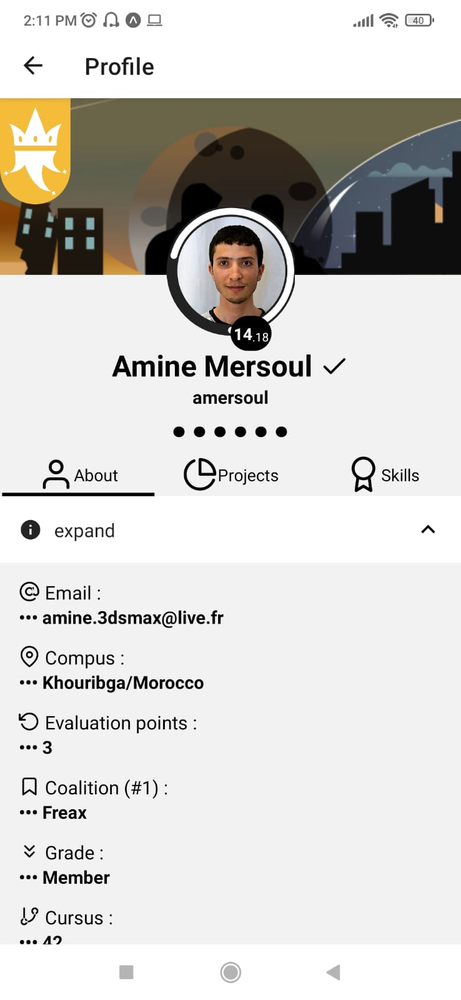
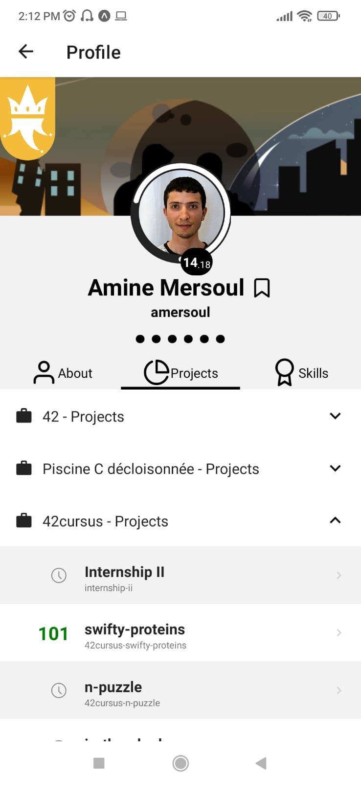
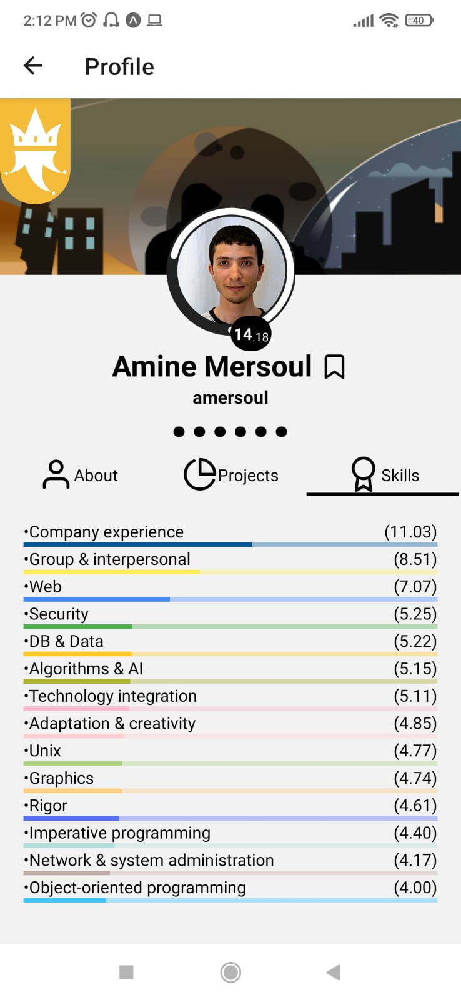
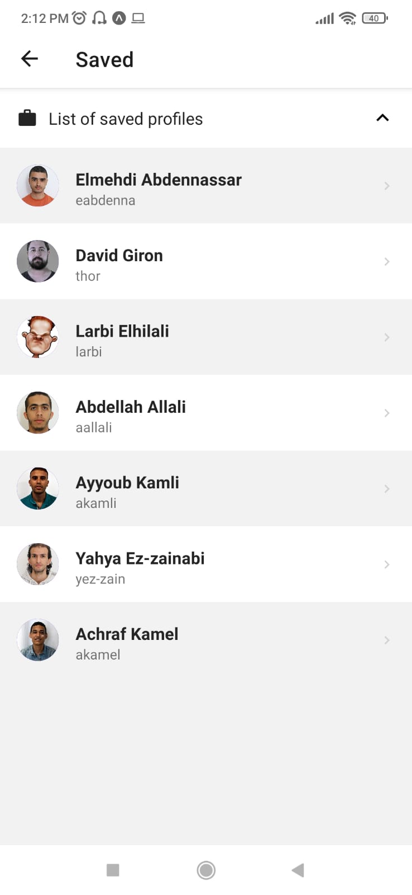
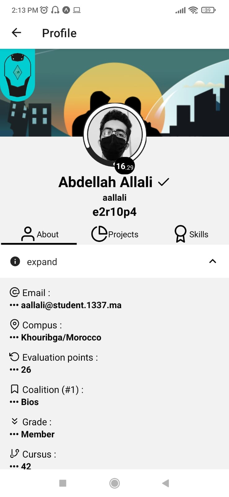
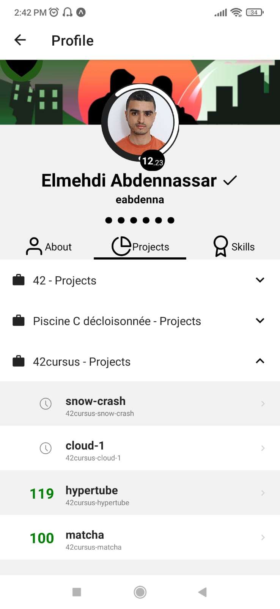
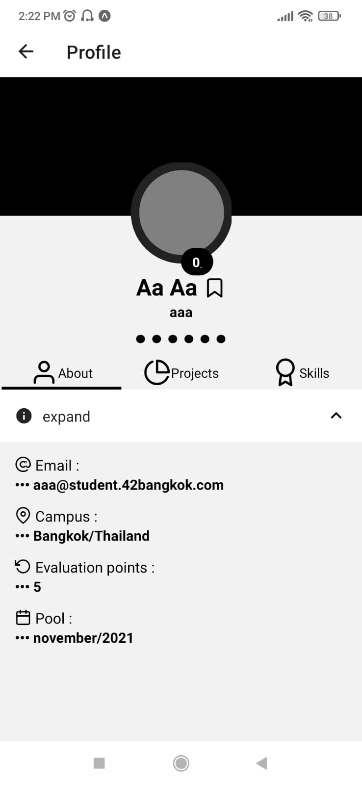
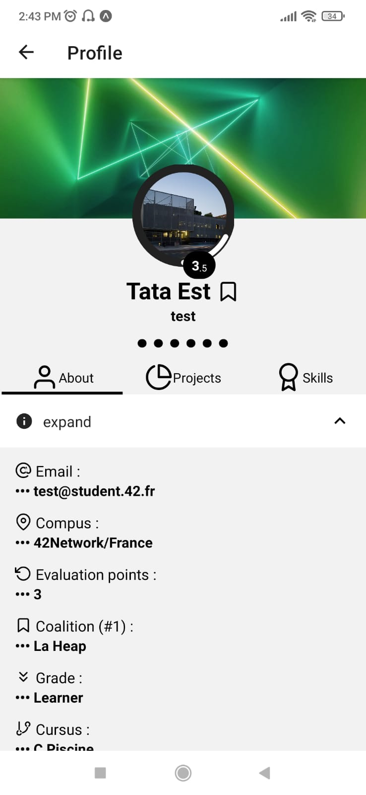

# 42-Swifty-Companion2

###Introduction
In this project you will discover how to developp a mobile application.

The aim of the projet is to build an application that will retrieve the information of 42 student,
using the 42 API. An API (Application programming interface) is a set of routines, protocols,
and tools for building software applications. APIs often come in the form of a library that includes specifications for routines, data structures, object classes, and variables. In other cases,
notably SOAP and REST services, an API is simply a specification of remote calls exposed to
the API consumers.

### Screen Shots :

 

### test profiles to check them during your building process

1. aaa
1. test
1. aallali
1. thor
1. larbi
1. amersoul
1. eabdenna
   ...

### Stack :

- react native :)

#### final mark 116/100

Typo: \*campus not compus (fixed)
